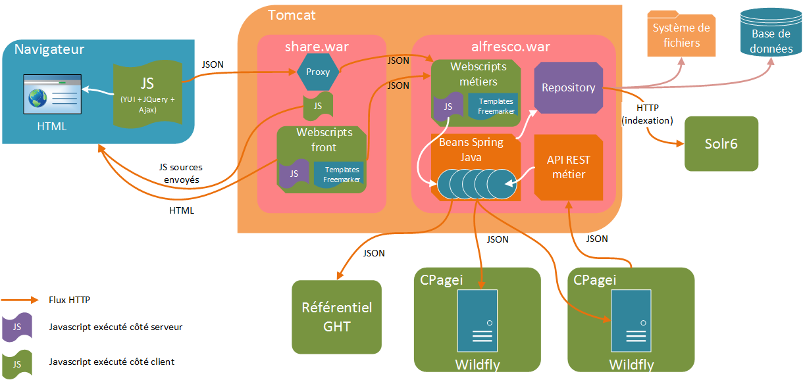
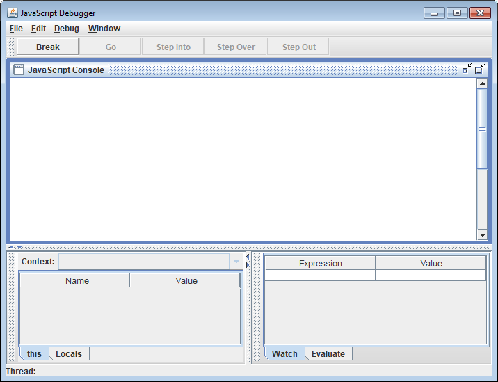

# Module Alfresco CPage

# Historique

Le module reprends le code du module PESV2 d'ATOLCD. C'est pourquoi dans les alias des fichiers modules.properties sont renseignés les noms des modules d'atolcd, pour rétro compatibilité. Il ne faut pas les supprimer.

## Vocabulaire
 * Les établissements sont appelés des collectivités

# Flux



## Module repository (alfresco.war)

Il contient toute la logique métier, expose les services pour CPagei, assure la persistance des données   

A ce titre, il est le seul à communiquer avec :
  * Les instances CPagei (par WS Rest/JSON) des établissements
  * Solr (par WS)
  * Le repository
  * Le référentiel GHT
       
Il expose des webscripts métiers qui permettent de sauvegarder, fournir et mettre à jour la configuration dans la page d'administration. Ces webscripts métiers retournent essentiellement des données au format JSON. Leurs backends est pour la plupart écrit en Javascript mais ils appelent (ou pas selon les cas) des beans spring écrit en Java pour accéder aux services métiers Spring au besoin.

Le Javascript que l'on retrouve dans ce module est exécuté côté serveur uniquement

## Module Share (Front)

Le module Share est responsable de l'affichage. Il contient des webscripts dont le rôle est de construire les pages HTML qui sont envoyées au navigateur client. Le backend de ces webscripts est écrit en Javascript (exécuté côté serveur donc).

Lorsqu'un page est demandée, le module envoie donc la page HTML (par le biais d'un webscript) mais également des fichiers sources Javascripts qui seront eux exécuter côté navigateur. Ces fichiers HS permettent :
  * D'alimenter les formulaires par des appels Ajax
  * De construire les données à renvoyer aux webscripts du module repository pour enregistrement par exemple. Attention, dans ce cas, l'appel passe forcément par le module Share qui sert de proxy pour relayer l'appel vers le module repository.
  
# Déploiement automatique
  * Contrats de webservices du module : [http://pr253-4.cpage.bas/swagger](http://pr253-4.cpage.bas/swagger)
  * PDF Modèle de données du module : [http://pr253-4.cpage.bas](http://pr253-4.cpage.bas)
  * Modules déployés sur [http://devged-alfresco.cpage.fr](http://devged-alfresco.cpage.fr)

# Mode développement

## Solr
Il faut démarrer Solr pour pouvoir lancer Alfresco en local. Voir le projet [cpage-solr-dev](https://gitlab.cpage.fr/GED/cpage-solr-dev)

## Alfresco
`mvn clean install -DskipTests=true alfresco:run` pour lancer le projet ou utiliser la launch confif Eclise du projet

 * Lance un Tomcat embarqué + H2 DB 
 * Lance la plateforme Alfresco (Repository) et le Share
 * Packages en JAR et en AMP

## Debug
### Code Java
Il faut simplement démarrer Alfresco avec la launch config mvn en mode Debug

### Code Javascript
Alfresco propose un debugger pour le javascript exécuté côté serveur pour les webscripts.
Pour cela, il faut se rendre sur la page d'aministration des webscripts [](http://localhost:8080/alfresco/s/index)
  - Cliquer sur le bouton Refresh Webscripts (permet de vider le cache des webscripts)
  - Cliquer sur Alfresco Javascript Debugger
  - Sur la page qui s'affiche, cliquer sur Enable.
 
Une nouvelle fenêtre s'ouvre alors, il s'agit du debugger de Webscript proposé par Alfresco. Lorsqu'un webscript sera appelé, son code sera remonté dans ce debugger. Il est alors possible de poser des points d'arrêts et de debugger.


  
Ce debugger ne fonctione que surun Alfresco démarré localement en mode développement.

## Hotswap externe à Eclipse

Il est possible de configurer un hotswap de code qui fonctionne mieux que celui d'Eclipse. Attention toutefois, il n'est pas compatible avec le mode debug d'Eclipse.
La launch config du projet est paramétrée pour autoriser le hotswap du code Java du module. Elle déclare le jar `hostswap-agent-core` situé dans le projet comme agent de la JVM.

Pour que l'agent fonctionne, il est nécessaire au préalable de patcher la JVM qui va servir au lancement du projet. Pour cela, il faut télécharger l'installeur qui correspond à la JVM utilisée : [https://github.com/HotswapProjects/HotswapAgent/releases](https://github.com/HotswapProjects/HotswapAgent/releases).

Après avoir lancé l'installer, celui liste les JVM qu'il a trouvé sur le poste. Il faut alors choisir celle qui va servir à lancer le projet puis cliquer sur le bouton ` Install DCEVM as altjvm` pour patcher la JVM.

# Policies

## Gestion des erreurs
Il faut faire attention sur les policies :
  * aux suppression de nodes
  * à la gestion des erreurs.
  
Une exception non catchée dans une policy provoque l'echec de la transaction et fait donc échouer l'appel en cours dans le cas d'un appel CMIS ou WS par exemple. Pour la gestion correctes des SAS par exemple, il est important de catcher (sauf cas particulier à documenter) toutes les exceptions dans une policy pour ne pas planter la transaction courante et les autres policies.

Il faut également toujours tester la bonne existante du noeud de l'évènement, car le node a pu être supprimé par une autre policy exécutée avant.

Exemple :

```java
  public void onCreateNode(final ChildAssociationRef childAssocRef) {
    try {
      if (!this.nodeService.exists(childAssocRef.getChildRef())) {
        return;
      }

      // Mon code ici
    } catch (final Throwable t) {
      // Tout catcher pour ne pas casser la transaction courante
      logger.error("Erreur sur le noeud " + childAssocRef.getChildRef(), t);
    }
  }
```


# Spring

## Injection

Les beans fournis par Alfresco peuvent être injectés directement avec l'annotation `@Autowired`.

Alfresco crée deux beans pour chaque service déployé, avec deux identifiants différents : une convention de nommage permet de distinguer ces deux beans. Pour chaque service, il y a :
  * le bean original -> Identifiant commençant par une minuscule
  * un bean correspondant en réalité à un proxy du bean original avec plusieurs intércepteurs (AOP) -> Identifiant commençant par une majuscule.

Les intercepteurs en question sont chargés de gérer les transactions, la sécurité et l'audit.

Pour l'injection, il faut choisir quel bean en spécifiant un qualifier (annotation `@Qualifier`)

## Exemple
```java
  // Bean original
  @Autowired
  @Qualifier(value = "nodeService")
  NodeService nodeService;
  
  // Bean proxyfié pour bénéficier des intercepteurs
  @Autowired
  @Qualifier(value = "NodeService")
  NodeService nodeService;
```

# Freemarker
La version de Freemarker utilisée par Alfresco est la **2.3.20**. Attention, beaucoup de références Freemarker visible dans la [doc Freemarker](https://freemarker.apache.org/docs/ref_builtins.html) ne sont pas disponible dans cette version.

# YUI
Le Share utiliser le framework Yahoo YUI dans sa version 2.9.0. Voici le lien vers la doc de ce framework [doc YUI](https://yui.github.io/yui2/docs/yui_2.9.0_full/)

# Consommation de WS
Le module consomme des WS sur :
  - Le référentiel GHT pour les natures de document
  - Les instances CPagei des établissements pour diverses notifications

## CPagei
### Utilisation

Il faut utiliser la classe `RestTemplate` de Spring pour consommer un WS vers CPagei. Le module étant multi-établissement, une connexion CPagei est associée à chaque établissement (collectivité).
Pour récupérer le `RestTemplate` de l'établissement, il faut utiliser le bean `RestTemplateProvider` en se l'injectant puis en utilisant la méthode `getClientForCPagei(String acronyme) ` de ce dernier en passant en paramètre la collectivité concernée. La méthide retournera null si l'établissement ne dispose dans sa configuration des informations de connexion à CPagei

```java
  @Autowired
  RestTemplateProvider restTemplateProvider;
  
  .......
    
  RestTemplate client = restTemplateProvider.getClientForCPagei(...);

```
### Paramétrage
Le paramétrage se réaliser via l'interface graphique Share, dans l'administration du module, premier onglet.
NB : Une adresse d'une instance de CPagei est configurable pour chacun des établissements déclarés


### Authentification
L'authentification vers CPagei est realisée par une authentification basique (login/mdp), en utilisant l'un des comptes de services disponibles dans CPagei.


## Référentiel GHT
### Utilisation
```java
  @Autowired
  @Qualifier(RestClientProvider.REF_GHT_QUALIFIER)
  RestTemplate restClient;
```
### Paramétrage
```properties
fr.cpage.ref.url = http://localhost:4600
```
### Authentification
L'authentification est réalisée par une authentification JWT vers un micro-service dédié
#### Paramétrage de l'authentification
```properties
# Connexion au service d'authentification
fr.cpage.auth.url = http://localhost:4600
fr.cpage.auth.jwt.login = userTest
fr.cpage.auth.jwt.password = userTest
fr.cpage.auth.jwt.keystore.filename = C:\\...\\keystore.pfx
fr.cpage.auth.jwt.keystore.type = PKCS12
fr.cpage.auth.jwt.keystore.alias = referentiel
fr.cpage.auth.jwt.keystore.password = secret
```

# Watermark

Un mécanisme permet d'appliquer un watermark textuel automatiquement sur les fichiers PDF simplement en mettant simplement des aspects/propriétés. Cela permet à des systèmes externes (comme APS) de pouvoir apposer un watermark.
Cette policy est à l'origine du problème.
`fr.cpage.ged.alfresco.repo.policies.WatermarkPolicy`. 

## Aspect
`cpage-common:watermark`

## Propriétés
  - `cpage-common:watermark-text` : Texte à apposer dans le watermark
  - `cpage-common:watermark-position-x` : Position en X du texte
  - `cpage-common:watermark-position-y` : Position en Y du texte
  - `cpage-common:watermark-size` : Taille du texte (12 par défaut si non précisé)
  - `cpage-common:watermark-page` : Page(s) sur laquel/lesquelles apposer le watermark. Valeurs possibles : 
    -  all
    -  odd
    -  even
    -  first
    -  last (valeur par défaut)
  - `cpage-common:watermark-source-version` : Ne pas valoriser. Métadonnée technique utilisée par le mécanisme

  

 
 
 
   
  
 
